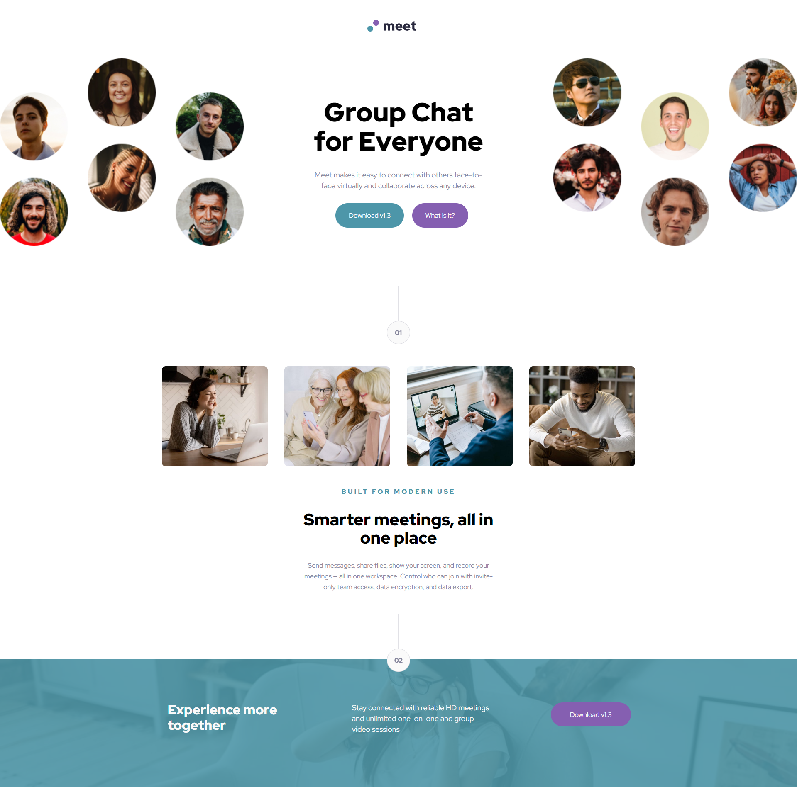

# Frontend Mentor - Meet landing page solution

This is a solution to the [Meet landing page challenge on Frontend Mentor](https://www.frontendmentor.io/challenges/meet-landing-page-rbTDS6OUR). Frontend Mentor challenges help you improve your coding skills by building realistic projects. 

## Table of contents

- [Overview](#overview)
  - [The challenge](#the-challenge)
  - [Screenshot](#screenshot)
  - [Links](#links)
- [My process](#my-process)
  - [Built with](#built-with)
  - [What I learned](#what-i-learned)
  - [Continued development](#continued-development)
  - [Useful resources](#useful-resources)
- [Author](#author)

## Overview

### The challenge

Users should be able to:

- View the optimal layout depending on their device's screen size
- See hover states for interactive elements

### Screenshots

### Links

- Solution URL: [GitHub](https://github.com/DrakeHermit/frontendmentor-meet-page)
- Live Site URL: [Live Site](https://drakehermit-meet.netlify.app/)

## My process

I started working on the mobile version of the design and gradually moved onto tablet and desktop designs.

### Built with

- Semantic HTML5 markup
- CSS custom properties
- Flexbox
- CSS Grid
- Mobile-first workflow

### What I learned

I learned a lot honestly, hidding and showing of content based on the device size, working with breakpoints closer even if it isn't perfect. I also learned that making a website responsive for all three device sizes is quite the arduous task.

### Continued development

I need to work on structuring my CSS and HTML better. HTML wise I need to work on making my website more accessible since that is something I struggle with.

## Author

- Frontend Mentor - [@DrakeHermit](https://www.frontendmentor.io/profile/DrakeHermit)

